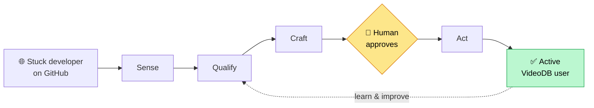

# VideoDB Growth Agent ("forge")

A careful, honest assistant that helps grow **VideoDB** — built for the VideoDB Forge program.

---

## What is this, in plain words?

Developers get publicly stuck on problems all the time — on GitHub, the world's biggest site where programmers share code and ask for help. Some of those problems are exactly what **VideoDB** solves (things like pulling frames out of a video, transcribing speech with timestamps, or searching inside a video by meaning).

This project finds those stuck developers, writes them a **genuinely helpful reply** with a working VideoDB example — and then **stops and waits for a human to approve it** before anything is posted in public. When a developer we helped later signs up and actually uses VideoDB for the first time, we count it.

The single number we care about is:

> ### 💰 Cost per activated developer
> *(all the money we spent) ÷ (developers who became active VideoDB users because of us)*



**This is not a spam machine.** Three promises are built into the code, not bolted on:

1. **Nothing posts by itself.** Every public reply waits for a real person to approve, edit, or reject it. The AI literally cannot post on its own.
2. **We only help when VideoDB genuinely fits.** If it's a stretch, we stay quiet.
3. **We always say who we are.** Every reply carries a short line disclosing our VideoDB affiliation — and the system refuses to post one that's missing it.

---

## 📖 New here? Start with the plain-English guide

If you're **not an engineer** (or just want the clear picture first), read the three-part guide in **[`docs/explained/`](docs/explained/)** — no technical background needed, every term defined, diagrams throughout:

1. **[The Architecture, Explained](docs/explained/01-architecture-explained.md)** — what the system *is* and how its parts fit together.
2. **[The Loop, Explained](docs/explained/02-the-loop-explained.md)** — one developer's journey from "stuck" to "active," step by step.
3. **[The Dashboard, Explained](docs/explained/03-dashboard-explained.md)** — a tour of every screen humans use to watch and steer it.

If you're an **engineer**, the authoritative technical spec is **[`CLAUDE.md`](./CLAUDE.md)**.

---

## How it works (the short version)

The system runs one repeating loop. Each stage is a filter — lots of threads come in the top, only the genuine fits make it through:

| Stage | In plain terms | Who does it |
|---|---|---|
| **Sense** | Search GitHub, drop duplicates, and let a cheap AI ask "is this real pain worth pursuing?" | automated + a cheap AI |
| **Qualify** | A smarter AI checks "is VideoDB *truly* the best answer here?" and scores the fit. | a strong AI + web research |
| **Craft** | Pick a pre-tested code example and write a helpful, honest reply (with the disclosure line). | a strong AI |
| **Human gate** | A person approves, edits, or rejects the draft. **Nothing skips this.** | 👤 you |
| **Act** | Post the reply (as a real human account), with an invisible tag so we can trace results. | plain code, after approval |
| **Observe** | When the developer becomes active, connect it back to our reply, and tally the cost. | plain code |

Only the three "AI" stages use a language model. Everything else is ordinary, predictable code — and money is spent only *after* a thread looks promising.

---

## Tech stack (for engineers)

TypeScript · pnpm workspaces · [Mastra](https://mastra.ai) (agents + workflows + scorers) · provider-agnostic model router (works with Anthropic, OpenAI, DeepSeek, Qwen, Mistral, OpenRouter, Ollama) · Postgres + pgvector · Next.js 15 dashboard.

## Quickstart (runs on your own computer)

```bash
# Prereqs: Node >=20, pnpm >=11, Docker Desktop running.
pnpm install
cp .env.example .env             # then fill in the keys (see below)
make db-up                       # starts Postgres + pgvector in Docker
pnpm --filter agent db:migrate   # create the database tables
pnpm --filter agent dev          # Mastra playground  → http://localhost:4111
pnpm --filter dashboard dev      # the dashboard       → http://localhost:3000
```

**Minimum keys to try it locally** (in `.env`): a model-provider key (e.g. `OPENROUTER_API_KEY`), a `GITHUB_TOKEN` (a free GitHub personal access token with `public_repo` scope), `DISCLOSURE_TEXT`, and `REVIEW_QUEUE_SECRET` (the dashboard password). Posting stays **off** by default (`TOUCHES_ENABLED=false`), so you can run the whole pipeline safely without touching real GitHub threads. Run `pnpm --filter agent preflight` to see exactly what's missing.

Anything still pending from VideoDB is tracked in **[`OPEN_QUESTIONS.md`](./OPEN_QUESTIONS.md)** — the build never blocks on it.

## Project layout

```
agent/         The brain — Mastra app (agents, workflows, scorers, tools, strategy, code snippets)
dashboard/     The screens — Next.js 15 review queue + live operations dashboard
db/            Database setup (Docker init: extensions, change notifications)
docs/          Design docs — including the plain-English guide in docs/explained/
submission/    Forge deliverables (metric, attribution, experiments, costs, …)
```

## The non-negotiables

This is **not** a spam engine. Every public action is human-approved (a Mastra workflow `suspend()` that waits for a person). Every reply must carry an affiliation disclosure line, and a deterministic guardrail hard-fails any draft missing it. There's a daily cap, no-double-contact deduplication, and a global kill-switch. Full rules and the reasoning behind them: [`CLAUDE.md`](./CLAUDE.md).

## License

MIT — see [LICENSE](./LICENSE).
