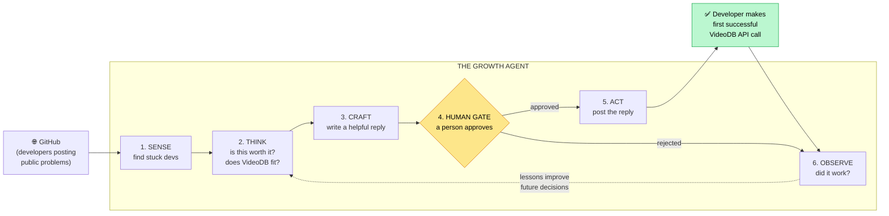
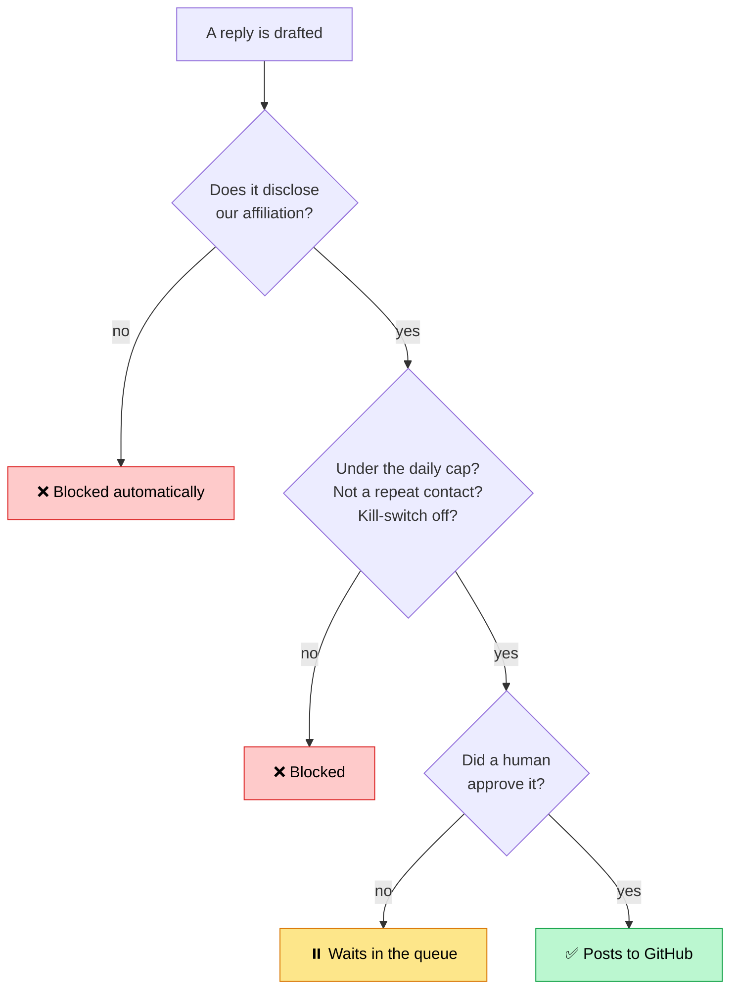
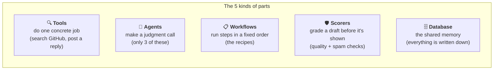
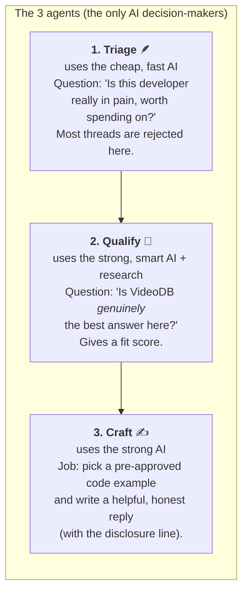
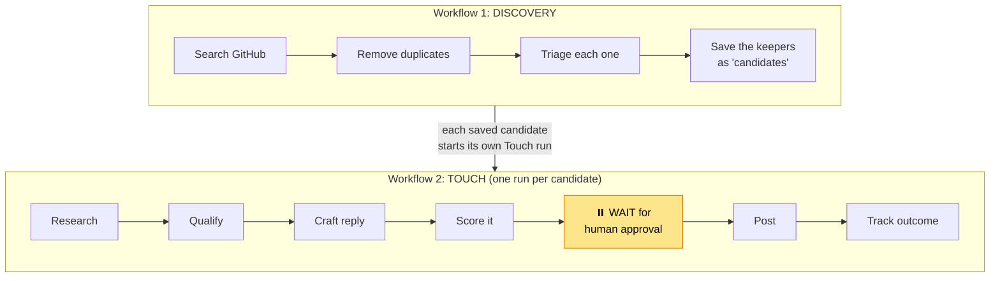
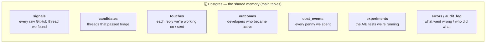
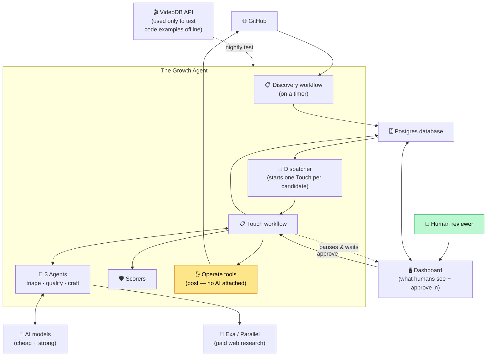

# Part 1 — The Architecture, Explained for Everyone

> **Who this is for:** anyone — non-engineers very much included. No prior knowledge assumed. Every technical word is defined the first time it appears, and again in the glossary at the end.
>
> **What you'll get:** a clear mental picture of *what this system is*, *what each part does*, and *how the parts fit together* — before we trace the step-by-step flow (Part 2) or tour the dashboard screens (Part 3).

---

## 1. The one-paragraph version

We built a **growth agent** for VideoDB. Its job: find software developers who are *publicly stuck* on a problem that VideoDB already solves, help them genuinely with a useful reply, and — only after a **human approves the reply** — post that help in public. When one of those developers later signs up and makes their first successful use of VideoDB, we count it. The single number we care about is **how much money it cost us to turn one developer into an active user**.

That's it. Everything below is just the machinery that makes this happen safely, cheaply, and measurably.

---

## 2. First, some words you'll need

You can skim these now and refer back. Each is the simplest accurate definition.

| Word | Plain meaning |
|---|---|
| **VideoDB** | The product we're growing. It's a tool developers use to work with video — extract frames, transcribe speech, search inside videos by meaning, etc. — through code. |
| **Developer** | A person who writes software. Our "customer" here. |
| **API** | "Application Programming Interface." The way one piece of software talks to another. When a developer "makes an API call to VideoDB," they're sending VideoDB a command from their own code and getting a result back. **Our success event is a developer's first *successful* API call.** |
| **GitHub** | The world's largest website where developers share code and discuss problems publicly. Think "social network + filing cabinet for code." People open **issues** (public posts describing a bug or question) — that's where we find stuck developers. |
| **Agent** | A piece of software that uses an AI model to *make a decision* rather than follow a fixed script. We have exactly three agents (triage, qualify, craft). Everything else is ordinary, predictable code. |
| **AI model / LLM** | "Large Language Model" — the kind of AI behind ChatGPT and Claude. It reads text and writes text. We use a *cheap, fast* one for quick decisions and a *strong, smarter* one for harder judgment. |
| **Workflow** | A defined sequence of steps the system runs, like a recipe. Unlike an agent, a workflow is fixed and predictable. |
| **Database** | An organized store of information the system can read and write. Ours is called **Postgres**. Picture a set of giant, well-labeled spreadsheets that many parts of the system share. |
| **Human gate** | The safety checkpoint. The system prepares a reply but *stops* and waits for a real person to approve, edit, or reject it before anything goes public. |
| **Attribution** | Connecting cause to effect: proving "this developer became active *because of* the reply we posted *there*." |

More terms get defined as they come up, and all of them are collected in the [Glossary](#glossary) at the end.

---

## 3. The big picture in one diagram

Here is the whole system at a glance. Don't worry about the details yet — just notice the shape: information flows from left (the outside world) to right (a developer becomes active), and there's a **human checkpoint** in the middle that nothing skips.

**Read it as a sentence:** We *sense* stuck developers on GitHub, *think* about whether helping is worth it and whether VideoDB truly fits, *craft* a helpful reply, a *human approves* it, we *act* by posting it, the developer eventually becomes active, and we *observe* the result to get smarter over time.

The yellow diamond is the most important shape in this entire document. **No public action ever happens without passing through it.**

---

## 4. The non-negotiable rules (why this isn't spam)

Before the parts, the principles. These are hard rules baked into the code, not nice-to-haves:

1. **Nothing posts by itself.** Every public reply waits for a human to approve it. The AI literally *cannot* post on its own — the tools that post are not connected to any AI. (In engineering terms: the "operate" tools are attached to no agent.)
2. **We only help when VideoDB is genuinely the best answer.** If it's a stretch, we don't touch the thread.
3. **We always disclose who we are.** Every public reply contains a short line saying we're affiliated with VideoDB. Hiding that would be dishonest ("astroturfing"). The system *refuses* to post a reply that's missing this line.
4. **We're capped and we never double-touch.** There's a daily limit on how many replies go out, and we never contact the same person or thread twice.
5. **There's a kill-switch.** One toggle stops all public activity instantly.

---

## 5. The parts of the machine

Now let's open the hood. The system has **five kinds of parts**. Think of them as different *types of worker* in a factory.

### 5a. Tools — the hands

A **tool** does exactly one concrete thing. Tools are dumb and predictable on purpose. Examples:

- **GitHub search** — goes to GitHub and finds threads matching our search terms.
- **Research tools (Exa, Parallel)** — look up extra context about a developer or problem on the wider web. (Exa and Parallel are outside companies whose search services we pay per-use.)
- **The "operate" tools (post a comment, open a code suggestion)** — these are the *only* tools that can change something in public. **Crucially, they are wired to no AI.** They run only inside a fixed workflow step, *after* a human has approved. This is a deliberate wall: the thinking parts can never touch the posting parts directly.

### 5b. Agents — the only parts that "decide"

An **agent** is software that hands a question to an AI model and uses the answer to decide. We have **exactly three**, and keeping it to three is intentional — AI is the expensive, unpredictable part, so we use it sparingly and only for genuine judgment:

A key detail for **Craft**: it does **not** write code freehand. It *chooses* from a library of **pre-written, pre-tested code examples** ("snippets") and fills in the blanks. This avoids the brand risk of an AI inventing code that gets posted publicly under VideoDB's name. If no example fits the developer's problem, the system simply doesn't reply.

### 5c. Workflows — the recipes

A **workflow** is a fixed sequence of steps. We have two, and *why* there are two is one of the most important design decisions in the whole project:

**Why split into two?** Because the human-approval step *pauses* a workflow run, and a run can hold only one paused item at a time. If we found 5 stuck developers in one big batch and ran them together, the first one waiting for approval would block the other four. So:

- **Discovery** runs on a timer, sweeps GitHub, and *never pauses*. It just produces a list of good **candidates**.
- **Touch** runs **once per candidate**, completely independently. Five candidates = five separate Touch runs, each pausing for its own approval. Approving candidate #3 has no effect on #1. (A small "dispatcher" is the part that starts one Touch run for each new candidate.)

> **Term:** a **"touch"** = one instance of us reaching out to one developer about one thread. The word shows up everywhere — a touch is the basic unit of work.

### 5d. Scorers — the automatic graders

Before a draft reply is ever shown to a human, two **scorers** grade it:

- **Quality scorer** — an AI judges: is this reply actually helpful and well-written? (Advisory — it informs the human.)
- **Spam-guardrail scorer** — a strict, non-AI checker: does the reply contain the required disclosure line? Is it within the daily cap? Is this a repeat contact? Is the kill-switch off? **If any check fails, the draft is hard-blocked.** This one is deliberately *not* AI — it's simple, exact rules you can trust completely.

### 5e. The database — the shared memory

Everything the system does is written down in **Postgres** (our database). Picture a set of labeled spreadsheets ("tables"), each holding one kind of thing:

Why this matters: because *everything* is written down, (a) the system can pause for days and resume exactly where it left off, (b) the dashboard can show a live, honest picture by simply reading these tables, and (c) we can always answer "why did this happen?" Every screen you'll see in Part 3 is just a friendly view of one or more of these tables.

> **Term:** **pgvector / embeddings.** To spot when two GitHub threads are really "the same problem," the system turns each thread's text into a list of numbers that captures its *meaning* (an **embedding**), and stores those in the database using an add-on called **pgvector**. Threads with similar numbers are likely duplicates. This is how we avoid bothering the same problem twice. (It's done locally and costs nothing.)

---

## 6. How the parts connect (the whole map)

Putting it together — here's who talks to whom. Follow the arrows:

Notice three things:

1. **The database (Postgres) is the hub.** Almost everything reads from and writes to it. The dashboard never pokes the workflows directly — it just reads the database and, to approve something, sends an "approve" message that resumes the paused Touch run.
2. **The AI (top right) only connects to the agents.** It never connects to the posting tools.
3. **The human (bottom right) sits between "draft ready" and "posted."** They are part of the machine, by design.

---

## 7. Where it all runs (very briefly)

- The **agent** (the brain — workflows, agents, tools) and the **dashboard** (the screens) are two programs that run side by side and share the one **Postgres** database.
- For testing, everything runs **on one computer** ("locally"): Postgres runs inside **Docker** (a way to run software in a clean, isolated box without installing it permanently), and the two programs run with simple commands.
- A **cron runner** is the part that, in production, keeps the loop turning on a schedule — sweep GitHub every N minutes, start touches, tally outcomes hourly, tidy up old data daily. ("Cron" just means "on a repeating timer.")

---

## 8. The one number that matters

Everything above exists to move a single metric:

> ### 💰 Cost per activated developer
> **= (all the money we spent) ÷ (number of developers who made their first successful VideoDB API call because of us)**

- The **money we spent** is tracked to the penny in the `cost_events` table — every AI call, every paid web search.
- An **activated developer** is counted only when we can *attribute* their first successful API call back to a reply we posted (more on how in Part 2).
- We deliberately **never dress up projections as targets.** Every number on the dashboard is a real, current count. When we don't have data yet, we show a dash ("—"), not a guess.

---

## 9. What's next

- **Part 2 — The Loop, Explained** walks through one developer's journey end to end, step by step, with the exact decisions made at each point and how money and outcomes get tracked.
- **Part 3 — The Dashboard, Explained** tours every screen and every card: what it shows, where the number comes from, and where that piece sits in the loop you just learned.

---

## Glossary

| Term | Meaning |
|---|---|
| **Agent** | Software that uses an AI model to make a judgment. We have 3: triage, qualify, craft. |
| **API** | The way software talks to software. A developer's first *successful* API call to VideoDB is our success event. |
| **API call** | One command sent from a developer's code to VideoDB. |
| **Attribution** | Proving a developer's activity was caused by a reply we posted. |
| **Candidate** | A GitHub thread that passed triage and is worth pursuing. |
| **Cron** | "On a repeating timer." The cron runner keeps the loop going on schedule. |
| **Dashboard** | The web screens humans use to watch the system and approve replies. |
| **Database** | Organized, shared storage. Ours is Postgres. |
| **Disclosure** | The honesty line in every reply stating our VideoDB affiliation. Required; auto-enforced. |
| **Dispatcher** | The small part that starts one Touch run per new candidate. |
| **Docker** | A way to run software (like our database) in a clean, isolated box. |
| **Embedding** | A list of numbers representing the *meaning* of a piece of text, used to detect duplicate threads. |
| **Exa / Parallel** | Outside paid services that do web research, used only after a thread looks promising. |
| **GitHub** | The public website where developers post code and problems. Where we find stuck developers. |
| **Human gate** | The mandatory approval checkpoint before anything goes public. |
| **Kill-switch** | A single toggle that stops all public activity. |
| **LLM / AI model** | "Large Language Model" — the text-reading, text-writing AI. We use a cheap one and a strong one. |
| **Operate tools** | The only tools that post in public. Wired to no AI; run only after approval. |
| **Postgres** | The specific database software we use. |
| **pgvector** | An add-on to Postgres that stores embeddings for similarity search. |
| **Scorer** | An automatic grader that checks a draft before a human sees it. |
| **Signal** | One raw GitHub thread we found, before any judgment. |
| **Snippet** | A pre-written, pre-tested code example the Craft agent fills in. Never freehand AI code. |
| **Tool** | Software that does one concrete job (search, post, look up). |
| **Touch** | One outreach to one developer about one thread — the basic unit of work. |
| **UTM** | A tracking tag added to links so we can tell which reply a signup came from (see Part 2). |
| **VideoDB** | The product we're growing — a developer tool for working with video. |
| **Workflow** | A fixed recipe of steps. We have two: Discovery and Touch. |
