# Part 2 — The Loop, Explained Step by Step

> **Who this is for:** everyone, non-engineers especially. If you've read [Part 1](01-architecture-explained.md) you know the parts; here we watch them work together by following **one developer's journey** from "stuck on GitHub" to "active VideoDB user." Terms are re-defined as they appear, and collected in the glossary at the end.

---

## The loop in one picture

The system runs the same six-stage loop over and over. Here it is. We'll then walk each stage slowly.

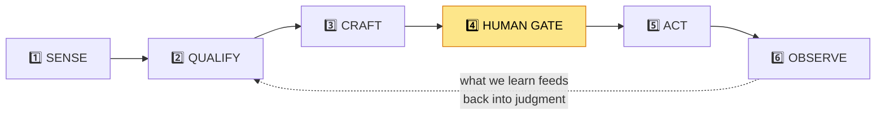

> **Why a "loop"?** Because it never really ends. New problems appear on GitHub every hour, so the system keeps sensing, and what it *observes* at the end makes its future judgments better. Round and round.

A real-world analogy: it works like a **thoughtful, honest salesperson who only ever helps** — they read the room (sense), check the product genuinely fits (qualify), write a useful answer (craft), run it past their manager (gate), send it (act), and see if it landed (observe) — then do it again, a little wiser.

---

## Meet our example: "Dana"

To make this concrete, follow **Dana**, a developer who posts this on GitHub:

> *"I'm writing a script to pull one frame every 5 seconds out of a video with ffmpeg, but it keeps choking on large files. Anyone have a cleaner way?"*

Dana is hand-rolling something VideoDB does natively. Perfect fit. Let's trace her journey.

---

## Stage 1 — SENSE: find developers who are publicly stuck

**Goal:** discover GitHub threads where a developer is struggling with a problem VideoDB solves — *before* spending any money or thought on them.

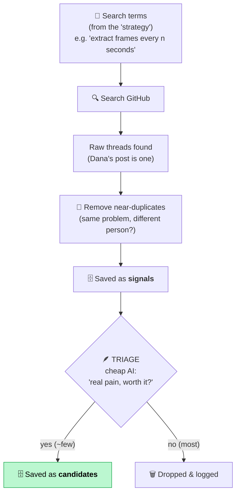

**What happens, in order:**

1. **Search.** On a timer (e.g. every 20 minutes), the **Discovery workflow** searches GitHub using a fixed set of search terms. Those terms live in one place called the **strategy** — the only part of the system that "knows" what we're hunting for. (We can swap the strategy to hunt for something else without touching anything else.)

2. **Each result is a "signal."** A **signal** = one raw GitHub thread we found, before any judgment. Dana's post becomes a signal. We store only what we need: the username, the link, the repo, and a short excerpt — *no emails, no profile scraping* (a deliberate data-minimization rule).

3. **Remove duplicates.** The same problem often appears in many threads. The system converts each signal's text into an **embedding** (a list of numbers capturing its *meaning*) and compares it to existing ones. If two are nearly identical, the later one is marked a duplicate of the first. This stops us paying to think about the same pain twice.

4. **Triage** (the first of our three AI agents). The **cheap, fast AI** reads each signal and answers one question: *"Is this a real, painful problem that's worth us spending money to pursue?"* Most signals are rejected right here (vendors advertising, already-solved questions, off-topic noise). The survivors are saved as **candidates**.

> **Why a cheap AI first?** Money. Research and the smart AI cost real money per use. Triage is a cheap filter so we only spend on threads that already look promising. **No money is spent before triage passes.**

Dana's signal is clearly real pain and a clean fit → it becomes a **candidate**. Discovery's job is done; it never waits for approval, it just keeps producing candidates.

---

## Stage 2 — QUALIFY: is VideoDB *genuinely* the best answer?

Now the **dispatcher** notices Dana's new candidate and starts a brand-new **Touch workflow** run just for her. (Remember from Part 1: one Touch run per candidate, so nobody blocks anybody.)

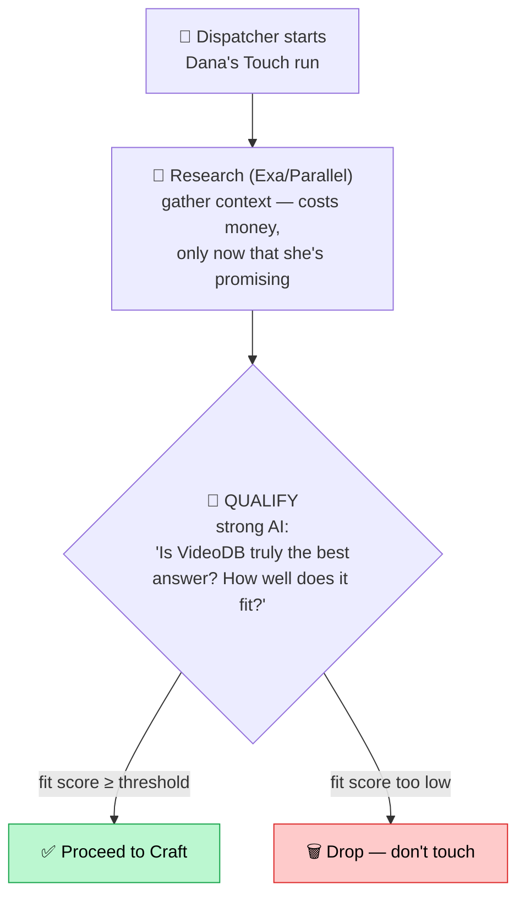

**What happens:**

1. **Research ("enrich").** Only now — because Dana already passed the cheap filter — do we spend money on **Exa** and **Parallel** (outside web-research services). They pull extra context about the problem. Every penny is recorded in the database, and there's a **daily budget**: if we hit it, research shuts off automatically ("fails closed").

2. **Qualify** (the second AI agent, using the **strong, smarter AI**). It answers: *"Is VideoDB genuinely the best answer here — not a stretch?"* and produces a **fit score** (a number, e.g. 0.0–1.0). Only candidates scoring above a set threshold continue. If VideoDB is a poor fit, we drop the candidate and *don't* reach out. This is the "value-first" rule in action.

Dana's problem (frame extraction) is exactly what VideoDB does → high fit score → proceed.

---

## Stage 3 — CRAFT: write a genuinely helpful, honest reply

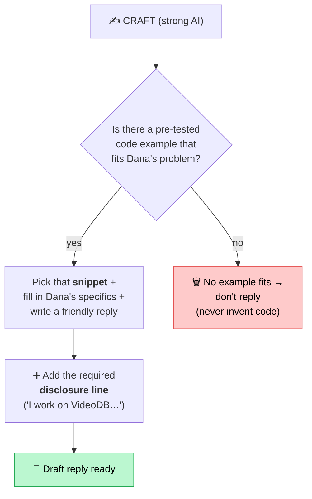

**What happens:**

1. **Pick a code example, don't invent one.** The **Craft** agent (third AI agent) does *not* write code from scratch. It chooses from a **library of pre-written, pre-tested code examples** ("snippets") and fills in Dana's specifics. There's a snippet for frame extraction, so it uses that. If *no* snippet fit her problem, the system would simply not reply. (This protects VideoDB's brand — no AI-improvised code ever goes out under VideoDB's name.)

2. **Write the reply** around that example: a warm, useful answer that actually solves Dana's problem.

3. **Add the disclosure.** A short honesty line — e.g. *"(I help build VideoDB — sharing because it fits this.)"* — is attached. This is mandatory.

The result is a **draft**: a complete reply, not yet posted.

---

## Stage 3.5 — The automatic graders (scorers)

Before any human sees Dana's draft, two **scorers** grade it:

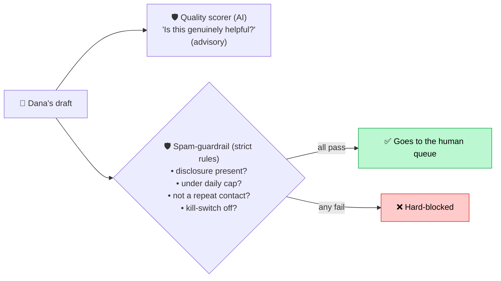

- The **quality scorer** uses AI to judge helpfulness — it's *advisory*, to inform the human.
- The **spam-guardrail** is deliberately *not* AI — it's simple, exact rules you can fully trust. Missing disclosure, over the cap, a repeat contact, or kill-switch on → the draft is **hard-blocked** and never reaches a human. Dana's draft passes all checks.

---

## Stage 4 — THE HUMAN GATE: a person decides

This is the heart of the whole design. The Touch workflow now **pauses** and waits. Dana's draft appears in the **dashboard** for a human reviewer.

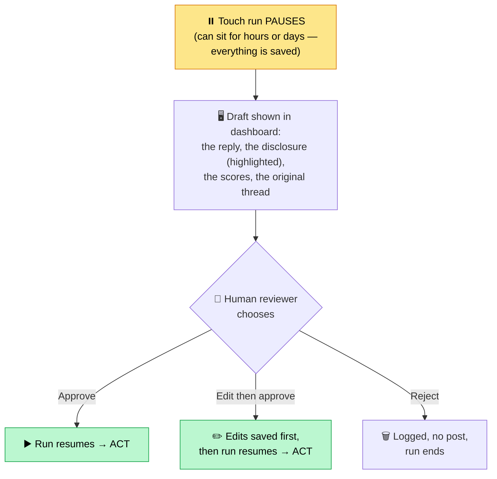

**What "pause" really means:** the system saves the entire half-finished run to the database and stops. It uses no resources while waiting. When the reviewer clicks **Approve**, the dashboard sends a "resume" message and the *same* run picks up exactly where it left off. This is why the workflow had to be split per-candidate (Part 1): so each pause blocks only its own draft.

The reviewer can **approve**, **edit then approve** (their edits are saved before posting), or **reject**. Nothing about Dana's draft becomes public until a human clicks approve.

> **The security view:** the dashboard is the *only* path to posting in public. So it's locked behind a password, every decision records *who* made it, and the reviewer can see exactly what will go out — disclosure and all.

Dana's reviewer reads the draft, sees it's genuinely helpful and properly disclosed, and clicks **Approve**.

---

## Stage 5 — ACT: post the reply (with a tracking tag)

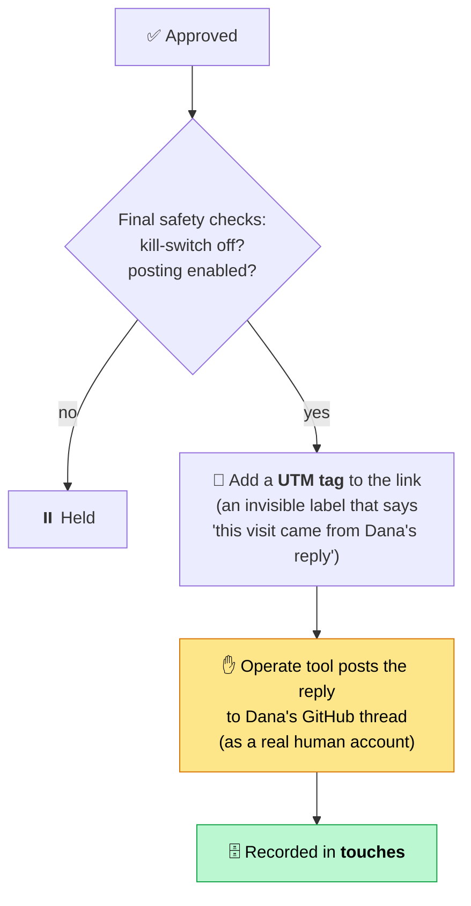

**What happens:**

1. **Final checks.** Even after approval, the system re-checks the kill-switch and a master "posting enabled" switch. Either can stop the post.

2. **Add a UTM tag.** Before posting, any link in the reply gets a **UTM tag**. A UTM is a small, invisible label added to a web link (you've clicked thousands of them). Ours encodes *which touch* this is. So if Dana later clicks the link and signs up, the system can connect that signup back to *this exact reply*. The tag's key piece is set to Dana's **touch ID**.

3. **Post.** The **operate tool** posts the reply to Dana's GitHub thread — using a real human account, never a bot. (Recall: this tool is connected to no AI; it runs only here, after approval.) The post is recorded in the `touches` table with the time it went out.

---

## Stage 6 — OBSERVE: did it actually work? (attribution)

Posting isn't success. **A developer becoming active is success.** The final stage connects the dots.

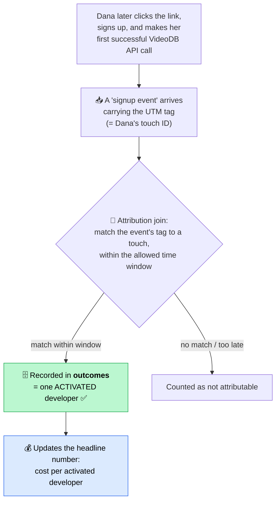

**What happens:**

1. **The success event.** Our defined success is a developer's **first successful VideoDB API call** — proof they didn't just sign up, they actually *used* the product.

2. **Attribution.** A regular job matches incoming signup events to our posted touches by the **UTM tag** — *if* the activation happened within an allowed **time window** (e.g. 21 days). "Attribution" just means *proving the cause*: Dana became active *because of* the reply we posted on her thread. A match is recorded in the `outcomes` table as one **activated developer**.

3. **The metric updates.** Now the headline number can be computed:

> **Cost per activated developer = total money spent ÷ activated developers.**

We report this honestly — a confident lower bound, never an inflated guess. If attribution is uncertain, we don't claim it.

4. **Learning.** Outcomes feed back: which kinds of threads, replies, and templates actually lead to activation? That sharpens future triage and qualify decisions. The loop comes full circle.

---

## The honest funnel (why numbers shrink at each stage)

Lots goes in the top; few come out the bottom — and that's *correct*. Each stage is a filter that saves money and protects quality.

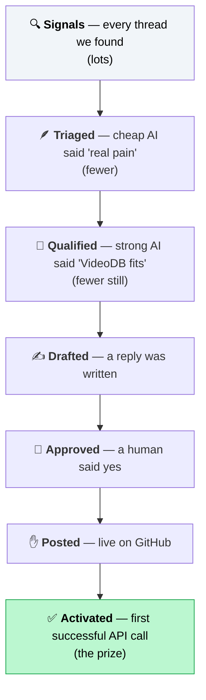

> **Important honesty note:** we never present a projected conversion rate as a *target*. The dashboard shows the *real* count at each stage. Early on, the bottom stages may read zero — that's truthful, not a failure.

---

## Two things happening in the background, always

### A) Cost metering — every penny, every time
Every paid action — each AI call, each web search — writes a row to the `cost_events` table the moment it happens. This is what makes "cost per activated developer" trustworthy: it's measured, not estimated. There's also a daily research budget that shuts spending off when hit.

### B) Experiments — learning what works (A/B tests)
We don't guess which approach works best; we **test**. An **experiment** (an "A/B test") tries two versions of something — say, two different disclosure wordings — and compares which leads to more activations.

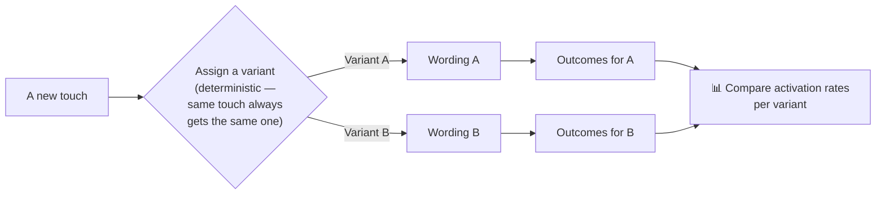

Each touch carries its experiment and variant label, and the same UTM machinery that proves activation also tells us *which variant* earned it. That's how we improve with evidence instead of opinion.

---

## When things go wrong (the system is honest about it)

Not every run succeeds — GitHub might rate-limit us, an AI call might fail, a search might error. The system is built to fail *safely and visibly*:

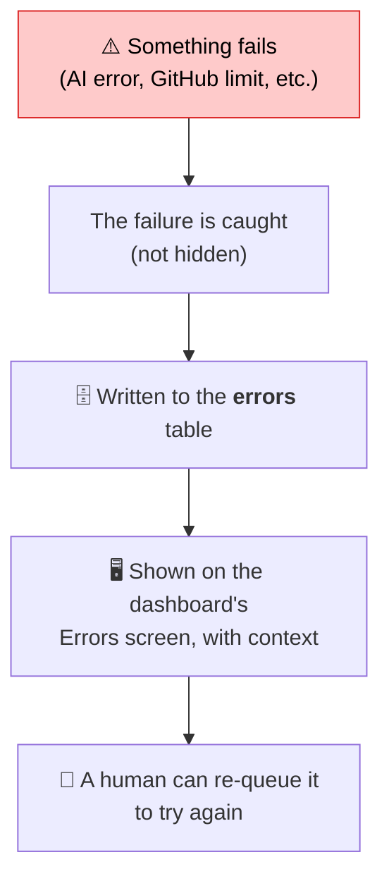

- **GitHub politeness:** the system respects GitHub's rate limits (how often you're allowed to ask), spaces out its actions, and backs off when told to. It's a careful, low-frequency guest, never a hammer.
- **Nothing fails silently:** errors are logged and surfaced, never swallowed.

---

## The whole journey, one final diagram

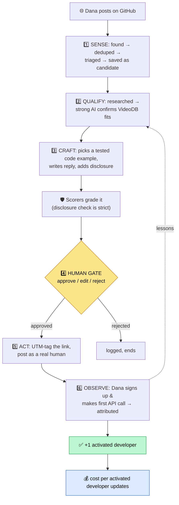

That's the complete loop. **Part 3** now shows you the dashboard — the window through which humans watch every stage above and approve the one step that matters.

---

## Glossary (loop-specific terms)

| Term | Meaning |
|---|---|
| **A/B test / experiment** | Running two versions of something to see which performs better. |
| **Attribution** | Proving a developer's activity was *caused* by a reply we posted. |
| **Attribution window** | The time limit (e.g. 21 days) within which a signup must happen to count as caused by our touch. |
| **Candidate** | A signal that passed triage — worth pursuing. |
| **Cost metering** | Recording every penny spent, as it's spent. |
| **Dispatcher** | Starts one Touch run per new candidate. |
| **Embedding** | Numbers representing a text's meaning; used to find duplicate threads. |
| **Enrich / research** | Paid web look-up (Exa/Parallel) done only after triage passes. |
| **Fail closed** | When unsure or over-budget, *stop* rather than risk acting. |
| **Fit score** | The qualify agent's number for how well VideoDB fits a problem. |
| **Outcome** | A recorded activation — a developer who made their first successful API call, attributed to us. |
| **Signal** | A raw GitHub thread we found, before judgment. |
| **Snippet** | A pre-tested code example the Craft agent fills in (never freehand). |
| **Strategy** | The single place defining what we hunt for and how we measure success. |
| **Touch** | One outreach to one developer about one thread — the basic unit of work. |
| **Touch ID** | The unique label for a touch, carried by the UTM tag to enable attribution. |
| **Triage** | The cheap first AI filter: "real pain, worth spending on?" |
| **UTM tag** | An invisible label on a link that records which reply a visit/signup came from. |
| **Variant** | One version (A or B) within an experiment. |
