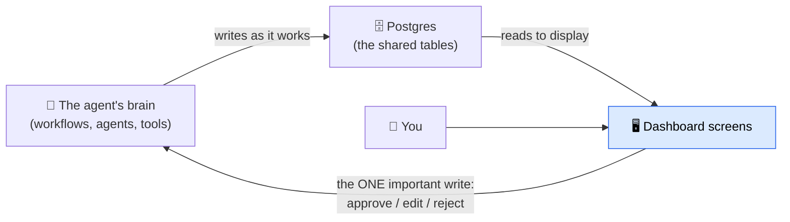
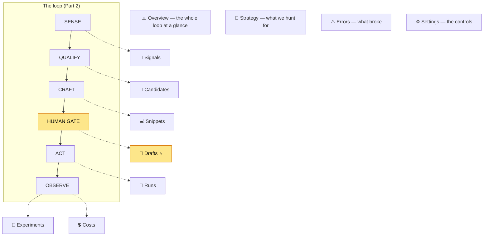
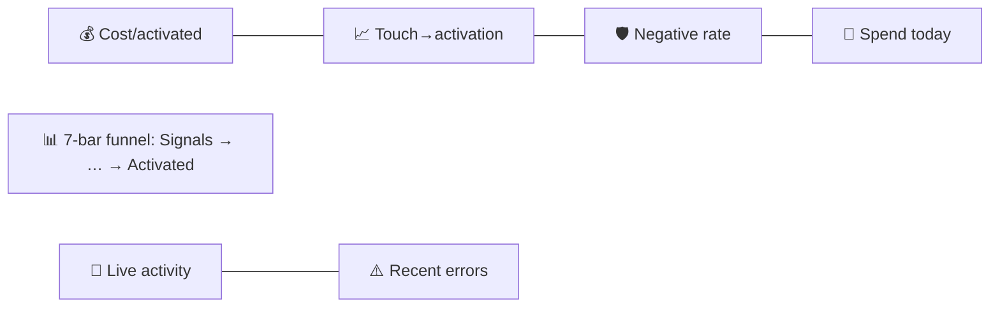
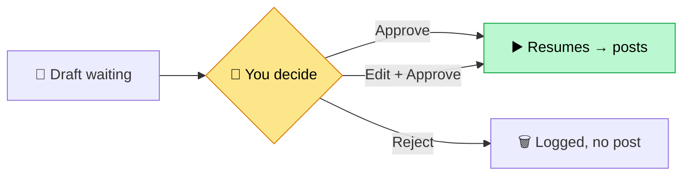
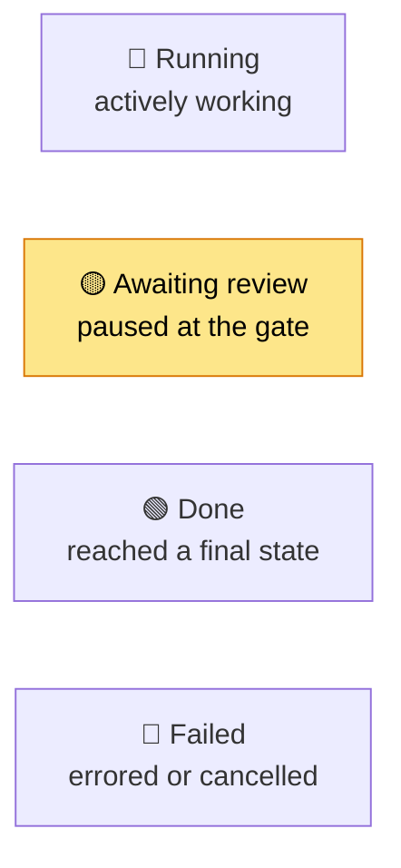
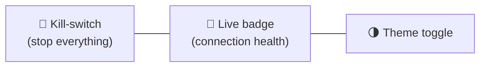
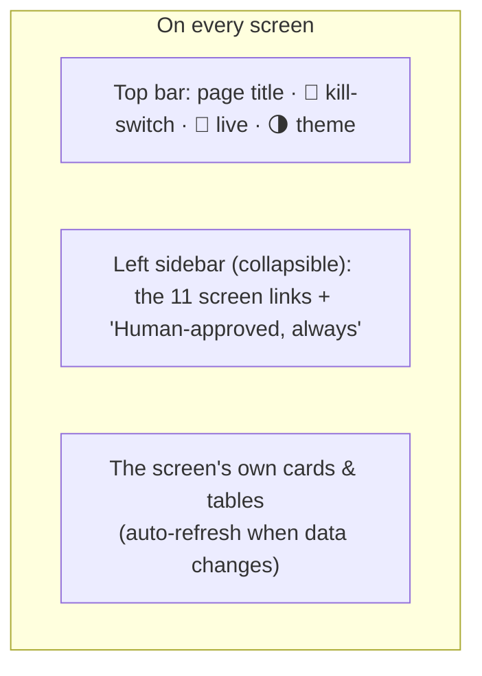
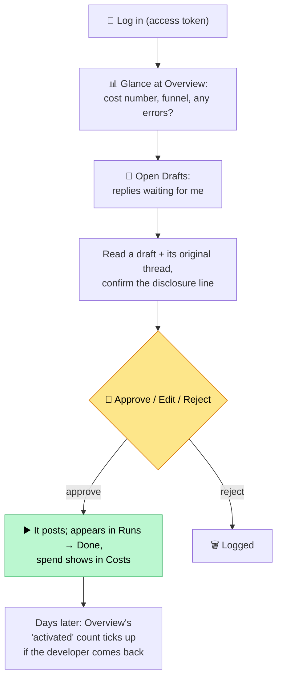

# Part 3 — The Dashboard, Explained Screen by Screen

> **Who this is for:** everyone, non-engineers especially. This is a guided tour of every screen you see when you open the dashboard in your browser. For each one: **what it shows**, **where the numbers come from**, **where it sits in the loop** (from [Part 2](02-the-loop-explained.md)), and **how it connects** to everything else.

---

## First: what *is* the dashboard?

The **dashboard** is a website — the human's window into the system. Two simple truths explain almost everything about it:

1. **It mostly just *reads* and *displays*.** Behind the scenes there's a shared database (Postgres) — a set of labeled spreadsheets called **tables**. The agent's brain writes to these tables as it works; the dashboard reads them and draws nice screens. So the dashboard is essentially **a live, friendly view of the database**.

2. **It has exactly one job that changes the world: approving replies.** That single action (and a couple of safety toggles) is the only time the dashboard writes anything important — and that's the human gate from Part 2.

**A few recurring ideas you'll see on every screen:**

- **"Live" updates.** Many panels refresh themselves the instant the underlying data changes — no page reload needed. A small **Live** badge in the top corner shows whether that live connection is healthy (live / connecting / offline). *(Technically: the database sends a nudge whenever a row changes, and the screen re-reads just what it needs.)*
- **It's locked.** The dashboard is the only path to public posting, so it sits behind a password (an "access token"). No token, no entry — and if the password isn't even configured, the whole site refuses to open. Safe by default.
- **Honest by design.** Every number is a real, current count from the database. When there's no data yet, you'll see a dash ("—"), never an invented figure.

---

## The map of screens

There are **11 screens** in the left sidebar, plus a few detail sub-screens. Here's how they line up against the loop — each screen is a window onto one stage:

Now let's walk each one.

---

## 📊 Overview — the north-star screen

**Where in the loop:** all of it — this is the bird's-eye view.

**What it shows:** four big number-cards, a funnel, and two live feeds.

**The four cards (top row):**

| Card | What it means | Where the number comes from |
|---|---|---|
| **Cost / activated developer** | *The* headline number. Total money spent ÷ developers who became active because of us. Shows "—" until the first activation. | `cost_events` table (money) ÷ `outcomes` table (activations) |
| **Qualified touch → activation** | Of the replies we posted, what fraction led to an active developer. A small chart shows the trend. | `outcomes` ÷ `touches` |
| **Negative-signal rate** | Replies that got deleted, flagged, or downvoted. Must stay at zero. (Checked by hand for now.) | manual review |
| **Spend today** | Every penny spent since midnight, with a 7-day mini-chart. | `cost_events` (today) |

**The Funnel (middle):** seven bars showing how many items reached each stage — Signals → Triaged → Qualified → Drafted → Approved → Posted → Activated. The bars shrink left-to-right, and that's healthy: each stage is a filter (see Part 2's "honest funnel"). Source: counts across the `signals`, `candidates`, `touches`, and `outcomes` tables.

**Two feeds (bottom):**
- **Activity stream** — a live ticker of things happening right now (a new signal found, a touch approved, an outcome recorded).
- **Errors (last 24h)** — recent failures, with a link to the full Errors screen.

**How it connects:** it summarizes every other screen. If a number here looks surprising, you click into the matching detailed screen below to understand why.

---

## 📡 Signals — raw threads, before any judgment

**Where in the loop:** Stage 1, SENSE (the very beginning).

**What it shows:** every GitHub thread the system found, *before* any AI judged it. Each row shows the repo, the author, the title, a short excerpt, and **which search term found it**. You can filter by search term or by repo.

**Two details worth knowing:**
- A small flag shows whether the thread has been **"embedded"** yet (turned into meaning-numbers for duplicate detection).
- **Duplicate clusters:** if several threads are really the same problem, they collapse under one "head" row, with the duplicates tucked underneath. This is the de-duplication from Part 2, made visible.

**Source:** the `signals` table (showing only the "head" of each duplicate cluster).

**How it connects:** these are the raw inputs. The ones that survive **triage** graduate to the next screen, Candidates.

---

## 🧭 Candidates — threads worth pursuing

**Where in the loop:** the bridge between SENSE and QUALIFY — these passed triage and are moving through the Touch workflow.

**What it shows:** every signal that the cheap triage AI judged worth pursuing. A row per candidate, each with a **status** showing how far it's gotten: *crafting → in review → approved/rejected → posted → activated*. Counts per status sit at the top. Click any candidate to open its **detail page**, which shows its full history — the original thread, the research, the qualify decision, the draft, the outcome.

**Source:** the `candidates` table, joined to `signals` (to show the original thread).

**How it connects:** each candidate triggers one **Touch run** (visible on the Runs screen) and, if it gets far enough, produces a **draft** (the next screen).

---

## 📝 Drafts — the human gate ⭐

**Where in the loop:** Stage 4, the HUMAN GATE. **This is the most important screen.**

**What it shows:** every reply that's finished being written and is now **waiting for a human to approve**. For each draft you see:
- the full reply text,
- the **disclosure line highlighted** (so you can confirm the honesty statement is present),
- the **scores** from the automatic graders,
- the original GitHub thread for context,
- today's **cap status** (how many replies have gone out vs. the daily limit).

**What you can do here** (the system's only world-changing action):
- **Approve** — the paused Touch run resumes and proceeds to post.
- **Edit, then approve** — your edits are saved *before* posting.
- **Reject** — nothing posts; it's logged.

**Source:** the `touches` table joined to `candidates`, `signals`, and the saved **paused-run** record. Your decision is sent back to the agent's brain to *resume the exact paused run* — the one important write the dashboard makes.

**How it connects:** this screen *is* the gate from Part 2. Everything upstream leads here; nothing goes public without passing through it.

---

## 🔀 Runs — every workflow run, like a kanban board

**Where in the loop:** a behind-the-scenes view of ACT and everything in motion.

**What it shows:** every workflow run the system has started, sorted into four columns:

Each run is a card. A **discovery run** is one sweep of GitHub; a **touch run** is one candidate's journey to the gate. Each card has a little **progress strip** showing which steps are done, in progress, or not yet reached. (Steps not yet reached simply show as "pending.")

**Source:** the saved workflow records (`mastra_workflow_snapshot`), joined to candidates and signals so each card can show what it's about.

**How it connects:** it's the "control tower" — if a candidate seems stuck, this is where you see *which step* it's sitting on (often "awaiting review," meaning it's in the Drafts queue).

---

## 💻 Snippets — the library of pre-tested code examples

**Where in the loop:** Stage 3, CRAFT — these are the building blocks Craft chooses from.

**What it shows:** every **code example** ("snippet") the Craft agent is allowed to use, and — crucially — each one's **latest test result**. Every night, the system runs each example against the *real* VideoDB product to confirm it still works. Green = passing, red = broken. A broken snippet is taken out of rotation.

**Source:** the `snippet_validations` table (the test results).

**How it connects:** remember from Part 2, Craft never invents code — it only fills in these pre-tested examples. This screen is the quality control behind that promise.

---

## 🎯 Strategy — what we're hunting for

**Where in the loop:** the "settings" for SENSE and the success definition for OBSERVE.

**What it shows:** the single, swappable definition of our whole mission, in plain view:
- the **search terms** used to find threads on GitHub,
- the **rubric** (the written guidance the triage and qualify AIs follow — "a strong fit is a developer hand-rolling something VideoDB does natively…"),
- the **success event** (first successful API call),
- the **attribution rules** (which tracking labels to use, and the time window),
- a **denylist** (things to avoid).

**Source:** read directly from the system's code (the one "strategy" file), not the database — because this is configuration, not live activity.

**How it connects:** change this one place and the whole system hunts for something different, without touching anything else. It's the system's "mission statement," made visible.

---

## 🧪 Experiments — testing what actually works

**Where in the loop:** OBSERVE — turning outcomes into learning.

**What it shows:** the A/B tests we're running (e.g. two disclosure wordings), and a **funnel per variant** so you can compare which version leads to more activations. It also flags any touches not yet assigned to a variant.

**Source:** the `experiments` table, plus `touches` joined to `outcomes` (to compare results per variant).

**How it connects:** the same UTM tracking that proves activation also records *which variant* earned it. This is how the project improves with evidence instead of opinion (Part 2's "experiments" background process).

---

## 💲 Costs — every penny, metered

**Where in the loop:** the money half of OBSERVE — the denominator of our headline metric is *not* trustworthy unless spending is measured exactly.

**What it shows:**
- a **summary** of total spend,
- a **daily chart**,
- **spend per candidate** (which threads cost the most to pursue),
- a **raw log** of every paid call.

There's also a **Retrieval** sub-screen showing the paid web-research spending specifically (Exa/Parallel), including how often a cached result saved us money and how close we are to the daily budget.

**Source:** the `cost_events` table (and `retrieval_cache` for the sub-screen).

**How it connects:** this is the "total money spent" in *cost per activated developer*. Every AI call and web search you read about in Part 2 writes a row here the moment it happens.

---

## ⚠️ Errors — what broke, and how to retry

**Where in the loop:** cross-cutting — failures can happen at any stage, and this screen makes them visible.

**What it shows:** caught failures from agents and workflows — an AI hiccup, a GitHub rate limit, a failed search — grouped by source, each with context and a **re-queue** button to try again.

**Source:** the `errors` table, joined to candidates/signals for context.

**How it connects:** the system's promise is to fail *visibly*, never silently (Part 2's "when things go wrong"). This is where that promise lives. The Overview screen shows a 24-hour preview; this is the full list.

---

## ⚙️ Settings — the controls and health checks

**Where in the loop:** the operator's toolbox — governs the whole machine.

It's a hub with three sub-screens:

| Sub-screen | What it shows | Source |
|---|---|---|
| **Database** | The list of tables, how many rows each holds, and a recent **audit log** (who did what — every approval, every toggle). | live database stats + `audit_log` |
| **GitHub budgets** | How much of GitHub's "ask quota" we've used. GitHub limits how often you can search vs. act; we track both **live from GitHub's own responses** and stay polite. | `github_requests` table |
| **Data & retention** | How much old data is due to be cleaned up (we delete raw threads after a set time), and a **"forget this user"** tool to erase someone on request. | `signals` + `audit_log` |

The main Settings page also shows which **AI models** are configured and whether each provider's credentials are present.

**The two controls that appear on *every* screen (top-right corner):**
- **Kill-switch** 🛑 — one toggle that instantly stops all public activity. Every flip is recorded in the audit log with who did it.
- **Live badge** 🔴 — shows whether the live-update connection is healthy.

**How it connects:** Settings is where a human stays in control — pause the system, audit its actions, manage data responsibly, and check its health.

---

## The components you see everywhere (the reusable pieces)

The screens are built from small reusable parts ("components"). You don't need to know their names, but here's what the recurring visual pieces *mean*:

| What you see | What it is / means |
|---|---|
| **Stat card** | A big number with a label and an explanatory hover — the KPI tiles on Overview. |
| **Sparkline** | A tiny 7-day trend chart tucked inside a card. |
| **Funnel bars** | The shrinking stage-by-stage counts. |
| **Status pill** | A small colored label showing an item's state (e.g. "in review," "posted"). |
| **"3m ago" timestamps** | Friendly relative times instead of raw dates. |
| **Live badge** | Health of the auto-update connection. |
| **Kill-switch toggle** | The global stop button. |
| **Approve / Edit / Reject buttons** | The decision controls on a draft. |
| **Re-queue button** | Retry a failed item (on Errors). |
| **"View JSON" / inspect** | A click-to-expand of the raw underlying record, for the curious or for debugging. |
| **Activity stream** | The live ticker of recent changes. |
| **Forget-user form** | The privacy tool to erase a person's data. |

---

## Putting it together: a reviewer's typical visit

That's the dashboard end to end. Together with [Part 1 (the architecture)](01-architecture-explained.md) and [Part 2 (the loop)](02-the-loop-explained.md), you now have the complete picture: **what** the system is, **how** it works, and **where** you watch and steer it.

---

## Glossary (dashboard-specific terms)

| Term | Meaning |
|---|---|
| **Audit log** | A permanent record of who did what (every approval, every toggle). |
| **Card / stat card** | A box on a screen showing one number or item. |
| **Component** | A reusable visual building block (a card, a button, a badge). |
| **Dashboard** | The website humans use to watch and steer the system. |
| **Funnel** | The stage-by-stage shrinking count from Signals to Activated. |
| **Kill-switch** | The global stop button, on every screen. |
| **Live badge** | Indicator of whether screens are auto-updating. |
| **Re-queue** | Asking the system to retry a failed item. |
| **Snapshot (workflow snapshot)** | The saved state of a workflow run, including paused ones. |
| **Sparkline** | A tiny inline trend chart. |
| **Status pill** | A small colored label showing an item's current state. |
| **Table** | One labeled "spreadsheet" in the database (signals, touches, etc.). |
| **Token / access token** | The password that unlocks the dashboard. |
| **UTM tag** | The invisible link label that ties a signup back to a specific reply. |

*(For terms used across all three documents — agent, API, attribution, embedding, touch, workflow, and so on — see the glossaries in [Part 1](01-architecture-explained.md#glossary) and [Part 2](02-the-loop-explained.md#glossary).)*
