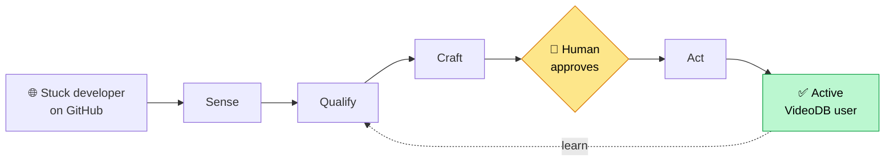

# Explained — the plain-English guide

A three-part, non-technical walkthrough of the VideoDB Growth Agent. **No engineering background needed.** Every technical word is defined the first time it appears and again in each part's glossary. Diagrams throughout (they render automatically on GitHub and most Markdown viewers).

Read them in order:

1. **[The Architecture, Explained](01-architecture-explained.md)** — *What the system is.* The big picture, the safety rules, and every part of the machine (tools, agents, workflows, scorers, database) and how they fit together.

2. **[The Loop, Explained](02-the-loop-explained.md)** — *How it works.* One developer's journey end to end, through all six stages — Sense → Qualify → Craft → Human gate → Act → Observe — including how money and outcomes are tracked.

3. **[The Dashboard, Explained](03-dashboard-explained.md)** — *Where you watch and steer it.* A tour of every screen and card: what it shows, where the number comes from, and where it sits in the loop.

---

### The 30-second summary

We built a careful, honest assistant that finds developers publicly stuck on problems VideoDB solves, writes them a genuinely helpful reply, and — **only after a human approves it** — posts that help in public. When a developer later becomes an active VideoDB user because of that help, we count it. The one number we optimize is **cost per activated developer**.

